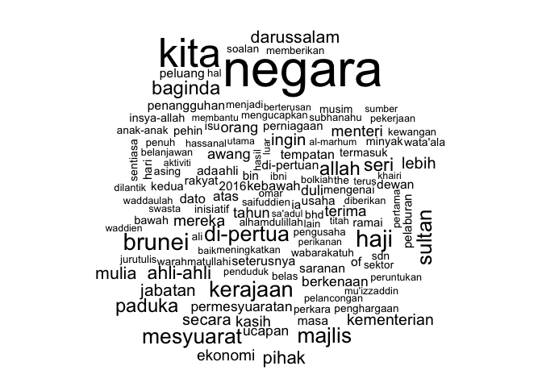

A quantitative text analysis of Brunei's Legislative Council meeting speeches
================

*Document last updated: 2017-02-09*

The Legislative Council of Brunei is known as the *Majlis Mesyuarat Negara* (MMN) in Malay. The MMN holds its sitting annually in March. The MMN was established in 1959 by virtue of Article 23 of the Brunei constitution. Having been suspended in 1983, the MMN was reestablished in 2004. The MMN has been instrumental in passing legislations and also in considering and approving state budgets and revenue estimates. Here's a [blogpost](http://bruneiresources.blogspot.co.uk/2009/03/history-of-brunei-legislative-council.html) on the history of the council by Rozan Yunos.

Aim
---

Official records of debates (Hansards) are available for all sessions, from the years 2006 to 2016. They are in PDF format and in the Malay language. The aim of this project is to publish a write-up of both the statistical methods and findings of the following research topics:

1.  Classical content analysis of the text of the speeches.
2.  Has there been a change in "mood" in parliament after the recent economic downturn and drop in oil prices?
3.  What is the evolution of topics debated year-on-year, and do they reflect the public opinion on the matter? Hot topics in recent years: scholarships availability, brain drain, unemployment, food prices, shariah law implementation.

Methodology
-----------

We will be using [R](https://cran.r-project.org) to perform all statistical analyses.

The quantitative content analysis will be performed using the [`quanteda`](https://github.com/kbenoit/quanteda) package. This will include the basic descriptive statistics of the texts to obtain an overview of what's potentially interesting.

For the inferential part, [Wordscores](http://faculty.washington.edu/jwilker/559/Laver.pdf) is an option to obtain polarity of the texts based on a certain dimension, e.g. austerity vs. spending. This is a form of supervised learning, so some reference texts (training set) need to be scored a priori.

For an unsupervised approach, the Poison scaling ["wordfish"](https://github.com/conjugateprior/austin/blob/master/vignettes/austin.Rmd) model can be employed. However, this might not be appropriate since the model assumes words are distributed independently, but in reality sentences and topics occur in sequence so they are probably correlated.

Alternatively, the non-parametric approach [Correspondence Analysis](https://en.wikipedia.org/wiki/Correspondence_analysis) can be tried. Just like PCA, it uses SVD to reduce the dimensionality of the text-by-word matrix. This is useful to group words by "similarity".

Finally, [topic models](https://eight2late.wordpress.com/2015/09/29/a-gentle-introduction-to-topic-modeling-using-r/) is an interesting model to extract themes of the conversation without any intervention from the modeller (unsupervised learning). The mathematics are a bit involved, but there are R packages which are able to do this.

Whatever the analysis, it is important to note that we have data over time, and any analysis should involve the time-varying dimension to infer changes over the course of past MMN sittings.

Things to do
------------

Where relevant, these will be linked to the issues section.

1.  Automatic data retrieval and pre-processing. See [\#2](/../../issues/2).
2.  Decide on methodology(ies). If using supervised learning, need subject matter experts to help rank texts.
3.  Compile a list of relevant Malay stop words. See [\#1](/../../issues/1).

Example using data from one session meeting
-------------------------------------------

The data are available from the [official MMN website](http://www.majlis-mesyuarat.gov.bn/JMM%20Site%20Pages/Laporan.aspx). As they are in a two column layout PDF format with headers, some careful conversion is required. The following is an example of how to load the data, perform some preprocessing and also some descriptive analysis using `quanteda`.

### Loading the data

``` r
mmn <- texts(readtext("/Users/haziqjamil/Desktop/GitHub/mmn/data/MMN PAGI PADA 22.3.2016 (penutup).txt"))
names(mmn) <- "MMN"
summary(mmn)
```

    ##   Text Types Tokens Sentences
    ## 1  MMN  2328  11096       391

Malay stop words.

``` r
malay.stopwords <- read.table("/Users/haziqjamil/Desktop/GitHub/mmn/data/malay_stopwords.txt", sep = "\n")
malay.stopwords <- as.character(malay.stopwords[, 1])
```

### Reprocessing the content

``` r
mmn.lower <- char_tolower(mmn)  # lowercase
mmn.word <- as.character(tokens(mmn.lower, removePunct = TRUE))  # tokenize
mmn.wordp <- as.character(tokens(mmn.lower))  # with punctuations
```

Split corpus into documents by speakers.

``` r
# Who spoke during the meeting? Find substring matching "Yang xxx:"
m <- gregexpr("Yang([^:.]+):", mmn)
speakers <- unlist(regmatches(mmn, m), use.names = FALSE)
speakers <- gsub("(\\s)+", " ", speakers)  # removes exessive whitespace
speakers <- gsub(":", "", speakers)  # removes ":"
speakers <- gsub("(\\s)*-\\s", "-", speakers)  # removes extra space after "-"
speakers[4] <- "Yang Berhormat Menteri di Jabatan Perdana Menteri dan Menteri Kewangan II"  # manual intervention...

speechVec <- unlist(char_segment(mmn, what = "other", 
                                 delimiter = "Yang([^:.]+):", perl = TRUE))
speechCorp <- corpus(speechVec)
docvars(speechCorp, "Speaker") <- speakers
summary(speechCorp)
```

    ## Corpus consisting of 16 documents.
    ## 
    ##    Text Types Tokens Sentences
    ##   MMN.1    54     64         2
    ##   MMN.2   112    186         8
    ##   MMN.3    34     38         1
    ##   MMN.4   683   1939        54
    ##   MMN.5    35     44         3
    ##   MMN.6   654   1813        65
    ##   MMN.7    28     31         1
    ##   MMN.8   865   2165        92
    ##   MMN.9    10     10         1
    ##  MMN.10    37     50         4
    ##  MMN.11   737   2165        72
    ##  MMN.12    36     39         1
    ##  MMN.13   195    441        15
    ##  MMN.14     9     10         2
    ##  MMN.15   416    840        35
    ##  MMN.16   455   1134        35
    ##                                                                              Speaker
    ##                                                            Yang Dimuliakan Jurutulis
    ##                                                        Yang Berhormat Yang Di-Pertua
    ##                                                            Yang Dimuliakan Jurutulis
    ##            Yang Berhormat Menteri di Jabatan Perdana Menteri dan Menteri Kewangan II
    ##                                                            Yang Dimuliakan Jurutulis
    ##  Yang Berhormat Menteri Tenaga (Energy) dan Perindustrian di Jabatan Perdana Menteri
    ##                                                            Yang Dimuliakan Jurutulis
    ##                                               Yang Berhormat Menteri Hal Ehwal Ugama
    ##                                                            Yang Dimuliakan Jurutulis
    ##                                                        Yang Berhormat Yang Di-Pertua
    ##                           Yang Berhormat Menteri Sumber-Sumber Utama dan Pelancongan
    ##                                                            Yang Dimuliakan Jurutulis
    ##                                        Yang Berhormat Menteri Hal Ehwal Dalam Negeri
    ##                                                        Yang Berhormat Yang Di-Pertua
    ##                                                   Yang Berhormat Menteri Pembangunan
    ##                                                        Yang Berhormat Yang Di-Pertua
    ## 
    ## Source:  /Users/haziqjamil/Desktop/GitHub/mmn/* on x86_64 by haziqjamil
    ## Created: Thu Feb  9 12:15:20 2017
    ## Notes:

For our purposes,

-   `Text` are the speeches of the `Speakers`;
-   `Types` are the number of unique words used in the `Text`;
-   `Tokens` are the number of words used; and
-   `Sentences` are self-explanatory.

### Analysis

#### Summary

How many times does the word "Brunei" appear?

``` r
mmn.word.brunei <- kwic(mmn.lower, "brunei")
head(mmn.word.brunei)
```

    ##                                                              
    ## [MMN, 963]                 yang di- pertuan negara | brunei |
    ## [MMN, 1194] penggerak dan majlis tertinggi wawasan | brunei |
    ## [MMN, 1522]                yang di- pertuan negara | brunei |
    ## [MMN, 1675]                yang di- pertuan negara | brunei |
    ## [MMN, 1931]                yang di- pertuan negara | brunei |
    ## [MMN, 2117]                yang di- pertuan negara | brunei |
    ##                                                 
    ## [MMN, 963]  darussalam, dasar fiskal dan        
    ## [MMN, 1194] 2035 yang kedua- duanya             
    ## [MMN, 1522] darussalam baik dari segi penjimatan
    ## [MMN, 1675] darussalam dalam apa jua\016        
    ## [MMN, 1931] darussalam, rakyat dan penduduk     
    ## [MMN, 2117] darussalam. akhir sekali,

``` r
nrow(mmn.word.brunei)
```

    ## [1] 50

Only 50 instances in one morning session meeting. However, from `kwic` it seems like most of these occured in conjunction with mentioning the Sultan or the government, as in "Sultan dan Yang Di-Pertuan Negara Brunei Darussalam".

What fraction of the total words are "Brunei"?

``` r
nrow(mmn.word.brunei) / ntoken(mmn.lower, removePunct = TRUE)
```

    ##         MMN 
    ## 0.005204538

Calculate the size of the vocabulary (number of unique words used).

``` r
length(unique(mmn.word))
```

    ## [1] 2156

#### Frequency plot

``` r
mmnDfm <- dfm(speechCorp, removePunct = TRUE, 
              remove = c("berhormat", "kaola", malay.stopwords))
mmnFeatures <- topfeatures(mmnDfm, 80)
mmnDf <- data.frame(term = names(mmnFeatures),
                    frequency = unname(mmnFeatures))
mmnDf$term <- with(mmnDf, reorder(term, -frequency))  # sort
ggplot(mmnDf) +
  geom_point(aes(x = term, y = frequency)) +
  theme(axis.text.x = element_text(angle = 90, hjust = 1))
```


#### Wordcloud

``` r
mmnDfm <- dfm(speechCorp, removePunct = TRUE, 
              remove = c("berhormat", "kaola", malay.stopwords))
textplot_wordcloud(dfm_trim(mmnDfm, min_count = 10, verbose = FALSE))
```



*Note: As is typical in quantitative text analysis, words are lower-cased. Proper nouns such as Allah, Sultan etc. are necessarily lower-cased.*

#### Lexical dispersion plot

``` r
textplot_xray(kwic(mmn.lower, "brunei"))
```


#### Comparative lexical dispersion plot

``` r
speakers[c(4,6)]
```

    ## [1] "Yang Berhormat Menteri di Jabatan Perdana Menteri dan Menteri Kewangan II"          
    ## [2] "Yang Berhormat Menteri Tenaga (Energy) dan Perindustrian di Jabatan Perdana Menteri"

``` r
smallSpeech <- corpus_subset(speechCorp, Speaker == speakers[4]) +
  corpus_subset(speechCorp, Speaker == speakers[6])
docnames(smallSpeech) <- c("YB Menteri Kewangan II", "YB Menteri Tenaga & Perindustrian")
textplot_xray(kwic(smallSpeech, "brunei")) 
```


